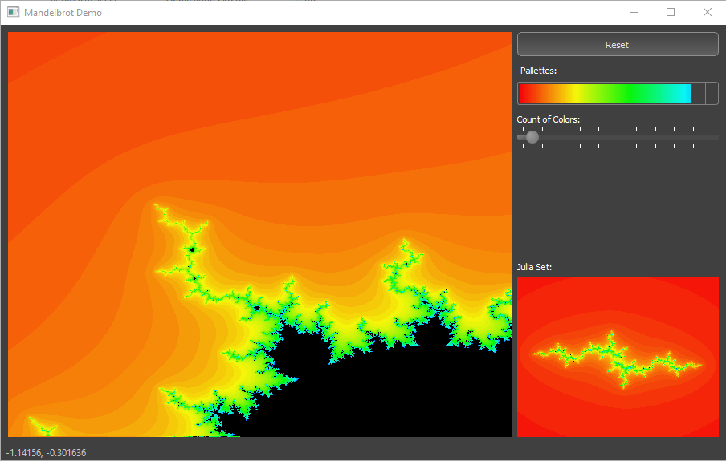

# FractalQT

Drawing of mandelbrot by QT

## Contents

## Versions

### Ver-0.1

Only concept & multi thread

### Ver-0.2

With Juila set

### Ver 0.3

Mouse event

### Ver 0.4

Hi-resolution

### Ver 0.5

With CUDA

### Ver 0.6

With OpenGL

### Ver 0.7

With QML

## References

<a href = 'https://en.wikipedia.org/wiki/Mandelbrot_set#:~:text=The%20Mandelbrot%20set%20(%2F%CB%88m,remains%20bounded%20in%20absolute%20value.'>Mandelbrot set</a>

<a href = "https://mateuszsiedlecki.com/index.php/2020/05/27/drawing-fractals-in-qt-using-threads/">Drawing fractals in Qt using threads</a>

<a href = 'https://lodev.org/cgtutor/juliamandelbrot.html'>Lode's Computer Graphics Tutorial</a>

<a href = 'https://scipython.com/book/chapter-7-matplotlib/problems/p72/the-julia-set/'>The Julia set using python</a>

<a href='http://www.alunw.freeuk.com/mandelbrotroom.html'>The Mandelbrot set and Julia sets</a>

<a href='https://www.karlsims.com/julia.html'>
Understanding Julia and Mandelbrot Sets, Karl Sims</a>

<a href='http://bl.ocks.org/syntagmatic/3736720'>Zoomable Julia Set</a>
